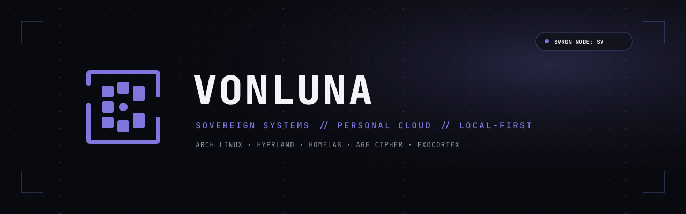

<div align="center">

  <!-- Header Banner Oficial VonLuna (Fase Eclipse) -->
  

  <br/><br/>

  <h1>Christian · VonLuna</h1>

  <p>
    <strong>Crafting sovereign systems, personal cloud & self-hosted agentic tools.</strong>
  </p>

  <p>
    <code>Systems Craftsman</code> · <code>Self-Hosted Advocate</code> · <code>Full-Stack & Mobile Dev</code>
  </p>

  <!-- Badges con los tokens de color oficiales VonLuna (#7F77DD y #090A0F) -->
  <p>
    
    
    
    
    
    
    
    
  </p>

</div>

---

### 🛡️ Filosofía & Arquitectura de Trabajo

- ☁️ **Soberanía Digital Absoluta:** Servidor propio (`vonlunasv-1`) como fuente canónica de verdad. Laptops y estaciones de trabajo concebidas como clientes efímeros y replicables.
- 🔄 **Pipelines CI/CD Soberanos:** Compilación, firmado de APKs y despliegue continuo ejecutados sobre runners propios de Forgejo sin dependencia de nubes comerciales.
- 🔐 **Seguridad Zero-Trust:** Secretos y dotfiles versionados bajo cifrado simétrico/asimétrico con `age` + `chezmoi`.
- 🧠 **Inteligencia Local-First:** Integración de modelos de lenguaje, grafos de conocimiento y asistentes de voz que corren y persisten sobre hardware propio.

---

### 🚀 Ecosistema de Proyectos

#### 🧠 IA, Agentes & Sistemas Cognitivos
- **`Luna` (Copiloto Agéntico Local-First):** Asistente autónomo multimodal con motor de wake-word local escrito en **Rust**, síntesis de voz neuronal con **Kokoro TTS**, GUI nativa en **egui**, y un bus de eventos WebSocket en **Node.js/TypeScript** conectado a la telemetría del servidor y APIs locales.
- **`Exocortex` (Memory & Knowledge Graph MCP):** Servidor Model Context Protocol que provee memoria episódica persistente, navegación en grafos de conocimiento y búsqueda híbrida para amplificar herramientas de desarrollo con IA.
- **`gmail-mcp-server`:** Servidor MCP especializado para clasificación, consulta estructurada y triaje soberano de correos electrónicos.

#### 📱 Aplicaciones & Plataformas
- **`LifeOS` (Sistema Operativo Personal):** Plataforma integral de gestión de tareas, hábitos y sincronización universitaria. Arquitectura con backend API en **Laravel**, aplicación móvil en **Flutter** (Android/iOS) con base de datos local **Isar**, y pipeline de release OTA automatizado en Forgejo Actions.
- **`Kitchy`:** Aplicación móvil en producción para planificación culinaria y gestión de recetas, desarrollada en **Flutter** con arquitectura reactiva basada en **Riverpod** y enrutamiento declarativo **GoRouter**.
- **`Omarchy Mobile Suite`:** Ecosistema de personalización visual para One UI (Android) que traslada la estética minimalista de Omarchy mediante widgets modulares **KWGT** y un pack de iconos basado en **Nerd Fonts**.

#### 🐧 Sistemas, Kernel & Desktop Rice
- **`vonluna-boot`:** Suite de arranque monocromática para hardware ASUS ROG Strix (G16) con animación de fases lunares en **Plymouth (C/Cairo)**, greeter vectorial fidedigno en **SDDM (QML)** y tema personalizado para **GRUB**.
- **`vonluna-brand`:** Sistema de diseño adaptativo multitemático por Fases Lunares (Eclipse, Blood Moon, Full Moon, Light Frost) con más de 240 assets vectoriales y rasterizados para perfiles, launchers y aplicaciones.
- **`dotfiles`:** Entorno de escritorio reproducible en **CachyOS / Arch Linux** sobre **Hyprland** (Wayland), orquestado con **chezmoi** y cifrado **age**.

---

### 🌐 Topología de Infraestructura (`vonlunasv-1`)

Opero un servidor de infraestructura personal bare-metal (16 núcleos, GPU NVIDIA RTX 2060 Super, almacenamiento masivo) interconectado mediante red mallada **Tailscale**:

```
[ Internet ] ──▶ Cloudflare Tunnel ──▶ Traefik Reverse Proxy
                                              │
    ┌────────────────────────┬────────────────┼────────────────────────┐
    ▼                        ▼                ▼                        ▼
Authentik (SSO)       Coolify / Docker     Forgejo (Git)          Nextcloud / Immich
  - Identidad central   - Stacks de apps     - CI/CD Runners        - Almacenamiento
  - Branding propio     - Bases de datos     - OTA Releases         - Nube personal
```

---

<div align="center">
  <sub>Diseñado y desplegado con soberanía técnica desde Puebla, México · <a href="https://vonlunant.site">vonlunant.site</a></sub>
</div>